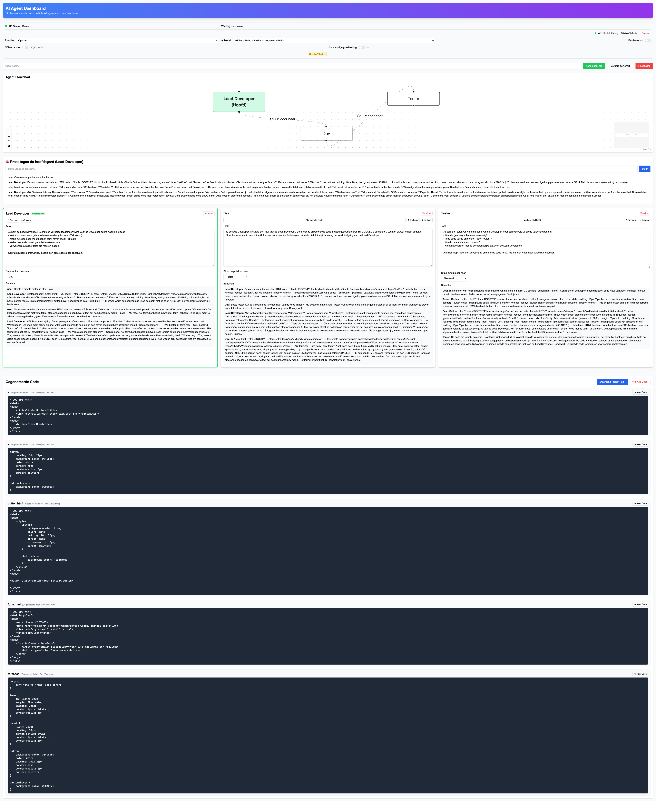

# AI-Agent Dashboard

A modular **React + Vite** application that lets you create, configure and chain multiple GPT-powered agents through an intuitive dashboard and an optional draggable flow-chart.

 <!-- (optional – safe to remove if you have no image) -->

---

## ✨ Features

| Category            | Details                                                                                 |
|---------------------|-----------------------------------------------------------------------------------------|
| Agent Management    | Add, rename or remove unlimited agents.                                                 |
| Task Assignment     | Give every agent its own **task description** that will be prepended to every prompt.   |
| Agent Chaining      | Forward an agent’s output to another agent to create processing pipelines.              |
| Conversation Log    | Every agent keeps a scrollable message history.                                         |
| Flow-chart View     | Toggle a **ReactFlow** view to visualise agents and their directed edges.               |
| Live Status         | Loading indicator per agent while it is waiting for the OpenAI response.               |
| Plug-and-Play UI    | Tailwind-styled reusable `Card`, `Button`, `Input`, `Textarea`, `Select` components.    |

---

## 🏗️ Architecture Overview

```
+---------------------+       props        +----------------------+
|  AIAgentDashboard   |------------------->|   AgentFlowchart     |
|  └── state (agents) |                    +----------------------+
|  └── add / remove   |                                ▲
|  └── deliverMessage |                                │
|  └── UI / routing   |     callbacks/props            │
+----------┬----------+                                │
           │                                           │
 iterates  │                                           │
           ▼                                           │
   +------------------+   task / forwardTo    +--------┘
   |    AgentCard     |-------------------------> other AgentCard…
   +------------------+

```

Core modules  

* **`src/AIAgentDashboard.jsx`** – global state, message orchestration, top-level UI  
* **`src/AgentCard.jsx`** – single agent card (task input, history, forwarding selector)  
* **`src/AgentFlowchart.jsx`** – visual graph (nodes & edges fed via props)  
* **`src/useAgentAPI.js`** – thin wrapper around the OpenAI Chat Completion endpoint  
* **`src/components/ui/*`** – unopinionated Tailwind UI primitives  

The central state is an `agents[]` array:

```
{
  id: string,
  name: string,
  task: string,
  forwardTo: string|null,
  messages: [{ from: string, text: string }]
}
```

`deliverMessage()` streams a message through the chain: it calls `callAgentTask()`, stores the response, then recursively forwards to the target agent if `forwardTo` is set.

---

## 🚀 Quick Start

### 1. Clone & install

```bash
git clone https://github.com/your-org/ai-agent-dashboard.git
cd ai-agent-dashboard
npm install
```

### 2. Configure your OpenAI key

Create a local **`.env`** file in the project root:

```
NEXT_PUBLIC_OPENAI_API_KEY=sk-...
```

If you run without a key the dashboard still loads, but API calls will fail.

### 3. Run the development server

```bash
npm run dev
```

The app will be served on **http://localhost:5173** (default Vite port).

### 4. Build for production

```bash
npm run build      # generates /dist
npm run preview    # serves the static build on http://localhost:4173
```

---

## 🕹️ Usage Guide

1. **Add an agent** – type a name in *“Agent naam…”* and click **Voeg agent toe**.  
2. **Describe its task** – open the new card and write a short instruction (“summarise text”, “translate to Dutch”, …).  
3. **Chain agents** – in *“Stuur output door naar”* pick another agent to form a pipeline. Loops are blocked automatically.  
4. **Talk to the head agent** – use the big input at the top. The first agent in the list is considered “head”.  
5. **Watch the flow-chart** – click *“Toon flowchart”* to visualise the graph in real-time.  
6. **Remove agents** – click **Verwijder** on any card (edges update automatically).

Tip: reorder by deleting and re-adding agents; the first element is always treated as the entry point.

---

## 🛠️ Development Notes

* **Tech stack** – React 18, Vite 4, Tailwind 4, ReactFlow 11.  
* **No backend** – the only external call is `fetch`ing `https://api.openai.com/v1/chat/completions`.  
* **Environment** – Works on modern browsers; local file running via Vite dev server.  
* **TypeScript** – not used to keep the demo concise, but the structure allows easy migration.

---

## 🤝 Contributing

1. Fork the repository  
2. Create a feature branch (`git checkout -b feat/my-change`)  
3. Commit your changes (`git commit -m 'feat: add …'`)  
4. Push to the branch (`git push origin feat/my-change`)  
5. Open a Pull Request  

Please run `npm run lint` (if you add ESLint) and include relevant screenshots/gifs.

---

## 📄 License

[MIT](LICENSE)

Feel free to adapt this dashboard for personal or commercial projects. Pull requests are welcome!
